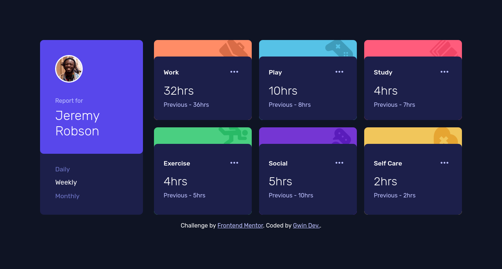

# Frontend Mentor - Time tracking dashboard solution

This is a solution to the [Time tracking dashboard challenge on Frontend Mentor](https://www.frontendmentor.io/challenges/time-tracking-dashboard-UIQ7167Jw). Frontend Mentor challenges help you improve your coding skills by building realistic projects. 

## Table of contents

- [Overview](#overview)
  - [The challenge](#the-challenge)
  - [Screenshot](#screenshot)
  - [Links](#links)
  - [Built with](#built-with)
  - [What I learned](#what-i-learned)
  - [Continued development](#continued-development)
- [Author](#author)

## Overview

### The challenge

Users should be able to:

- View the optimal layout for the site depending on their device's screen size
- See hover states for all interactive elements on the page
- Switch between viewing Daily, Weekly, and Monthly stats

### Screenshot

### Links

- Solution URL: [Add solution URL here](https://github.com/Gwinjoe/time-tracking-dashboard)
- Live Site URL: [Add live site URL here](https://gwinjoe.github.io/time-tracking-dashboard/)

### Built with

- Semantic HTML5 markup
- CSS custom properties
- Flexbox
- CSS Grid
- Mobile-first workflow

**Note: These are just examples. Delete this note and replace the list above with your own choices**

### What I learned

I learned about the use of JSON files for frontend projects.

### Continued development

I would like to continue to work on dynamic projects with more complicated stylings to help me grow and build my skills. If it where possible to add projects with backend functionalities, it will be great. Also, i appeal to you all at frontend mentor to please provide more difficult challenges to the free users like us, it will mean a lot. Thanks

## Author

- Frontend Mentor - [@yourusername](https://www.frontendmentor.io/profile/Gwinjoe)

